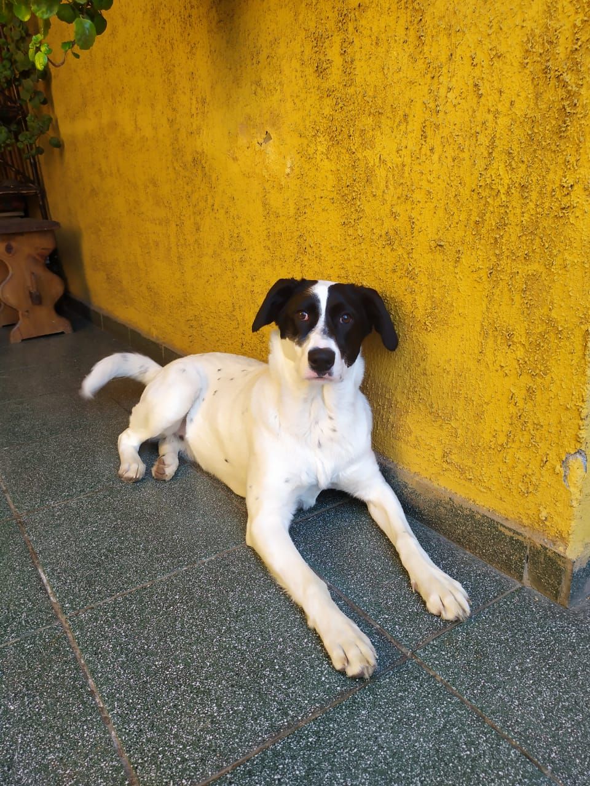

{width="360px"}

**Yuki Chips** es mi bebé. Yuki es un nombre japonés que tiene varios 
significados, uno de ellos es *nieve*. Entonces como es blanca con manchitas 
es *Yuki Chips*. 

Llegó a la casa el 2 de Feb del 2020, tenía 2 meses. La recogieron de un 
peladero en Lampa, la habían botado a ella y a sus hermanites. Por suerte 
estaba sanita, con un par de pulgas no más. Pero nada que no se quitara fácil.

Ahora tiene 10 meses, pesa 24 kilos y es la regalona de la casa.
